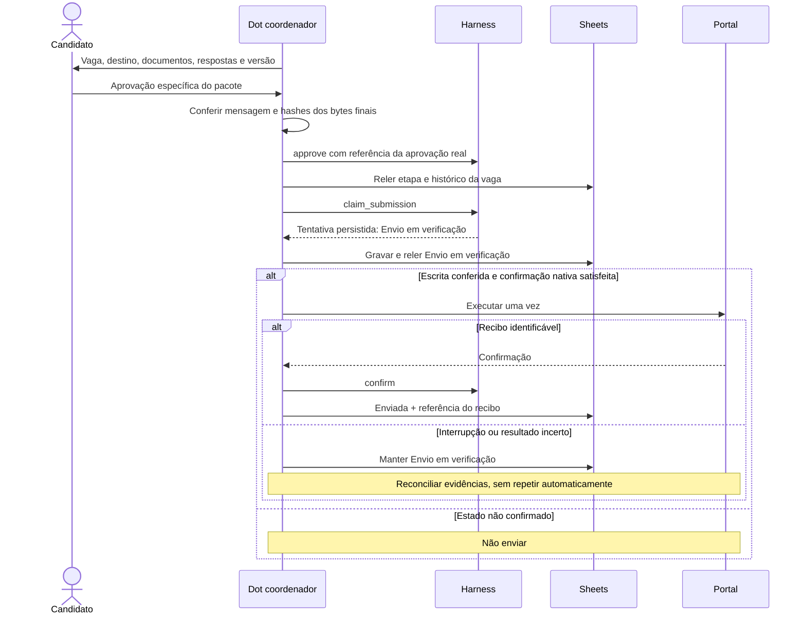

# Arquitetura e responsabilidades

O [diagrama principal](README.md#arquitetura) apresenta os componentes e os caminhos de autorização. O Dot é o coordenador; subagentes executam tarefas delimitadas; skills descrevem os procedimentos; MCPs são interfaces com serviços; o harness guarda estado e verifica condições.

## Componentes

| Componente | Entrada | Saída | Responsabilidade |
|---|---|---|---|
| Coordenador | Perfil, decisões, estado e eventos | Atualizações, revisão e histórico | Único escritor do Sheets e executor de envio aprovado |
| Pesquisador | Cargos, restrições, chaves conhecidas e orçamento | Anúncios e evidências | Pesquisa pública; sem documentos pessoais |
| Avaliador | Anúncios e fatos com proveniência | Aderência, lacunas, desconhecidos e elegibilidade | Análise; não inventar experiência |
| Preparador | Vaga selecionada e perfil confirmado | Documentos, respostas, hashes e versão | Rascunhos para revisão |
| Acompanhamento | Processos rastreados e referências | Propostas de etapa com evidências | Leitura de mensagens pertinentes; sem responder |
| Harness | Decisões encaminhadas pelo coordenador | Aceite ou recusa, estado persistido | Orçamento, exclusão de rodadas, controle de tentativa |
| Sheets/Drive | Atualizações e ações do candidato | Interface e histórico durável | Perfil, vagas, documentos privados e decisões |

O fluxo pode usar agentes nativos em segundo plano. A skill correspondente deve ser lida e passada a cada delegado. Registrar o identificador real, contexto fornecido, ferramentas utilizadas, saída e falhas. Uma instrução “aja como pesquisador” no mesmo contexto não equivale a delegação.

## Integrações

| Conector existente | Uso | Dados necessários |
|---|---|---|
| Exa | Descoberta de vagas e páginas de carreira | Consultas por cargo e localização |
| Parallel Search | Cobertura complementar | Consultas que faltaram; evitar duplicar toda a busca |
| Firecrawl | Descrição completa das páginas selecionadas | URL pública |
| Google Drive / Sheets | Perfil, documentos, controle e histórico | Configuração privada da implantação |
| Gmail | Confirmações e mudanças de etapa | Referências dos processos rastreados |
| Navegador do Dot | Envio especificamente aprovado e conferência | Pacote aprovado para o destino exato |

Não há um novo servidor MCP neste pacote. Um anúncio publicamente legível não autoriza enviar candidaturas por API. O navegador local é uma alternativa para sessões que realmente o exijam; não é requisito da busca na nuvem.

## Rodada de busca

1. Carregar a versão fixada do pacote, as skills, o perfil e o estado da planilha.
2. Abrir o banco privado e iniciar uma rodada com ID único. Uma rodada antiga ativa exige reconciliação, não expiração automática.
3. Reservar orçamento antes de delegar; as parcelas de todos os pesquisadores somam no máximo 6 consultas e 10 novas descrições. Falhas também consomem a parcela tentada. Registrar reservado e efetivamente consumido.
4. Pesquisar e acompanhar e-mails em paralelo quando houver processos rastreados. Avaliar os anúncios com fatos confirmados do perfil.
5. Resolver identidade por portal + organização + ID e também consultar URL original normalizada. O helper job_key gera a chave principal; o coordenador mantém o índice de aliases e não usa título + empresa como identidade.
6. Reler a linha por ID antes de escrever. Comparar snapshot, linha atual e proposta com merge_patch. Preservar campos do candidato, investigar conflitos e escrever somente as células necessárias.
7. Conferir a gravação, registrar evidências e limitações no Histórico e finalizar a rodada. Avisar somente fatos acionáveis ainda não comunicados.

## Fluxo de envio

Marcar “Autorizada” na planilha não constitui autorização suficiente. A evidência humana precisa identificar a candidatura e o material. Alteração do destino, documento ou resposta muda o hash e exige nova revisão.

## Garantias e fronteiras

SQLite oferece transações locais e índices únicos para uma rodada ativa e uma tentativa por ID de vaga. WAL e synchronous=FULL protegem commits dentro das garantias do sistema de arquivos. Os testes abrem o mesmo banco em outro processo; isso não prova retenção por tempo ilimitado no provedor.

Não existe transação distribuída com Sheets ou portais. A política prefere manter uma tentativa incerta para revisão a repetir uma candidatura. Também não promete “exactly once” se alguém ignorar o harness, trocar a identidade da vaga ou apagar todo o histórico.

merge_patch detecta mudanças entre as leituras fornecidas. Uma edição posterior à última leitura ainda pode coincidir com a gravação; escrita pontual, conferência e reconciliação reduzem esse risco. Sheets não fornece aqui um compare-and-swap por célula.

Os contratos de leitura dos especialistas são instrucionais quando o runtime não oferece isolamento de ferramentas. SQLite, aprovação e confirmação nativa são controles complementares; nenhum deles deve ser apresentado como autenticação humana completa.

## Referências

- [OpenAI — Tasks and memory](https://learn.chatgpt.com/docs/dots/tasks-and-memory): agentes em segundo plano, contextos e agendamentos.
- [OpenAI — Computers and apps](https://learn.chatgpt.com/docs/dots/computers-and-apps): ambiente na nuvem, arquivos e conexão do computador.
- [OpenAI — Dots privacy, security and safety](https://help.openai.com/en/articles/20001529-dots-privacy-security-and-safety-faqs): permissões e confirmações nativas.
- [Greenhouse — Job Board API](https://developers.greenhouse.io/job-board): diferença entre leitura pública e envio autenticado.
- [Claude Works](https://github.com/andrewaws26/claude-works) e [Job Agent MCP](https://github.com/Shreya123989/job-agent-mcp): referências de desenho consultadas; não instaladas, testadas nem incorporadas como dependências.
