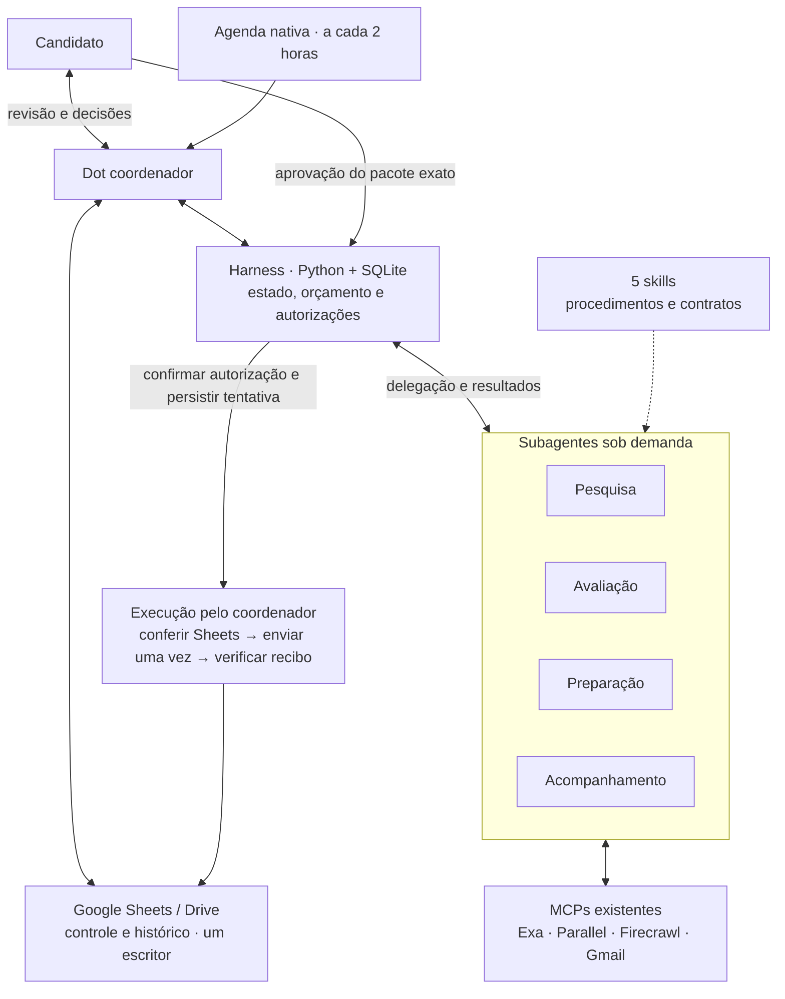

# Dot Job Search Harness

Um assistente de busca de emprego com **Dot coordenador, quatro perfis de subagentes, cinco skills e um harness em Python/SQLite**. Google Sheets oferece o controle de vagas vistas, decisões e candidaturas. MCPs conectados fornecem busca, leitura e acompanhamento.

O objetivo é encontrar vagas compatíveis com fatos profissionais verificáveis, manter o histórico e preparar candidaturas que o candidato pode revisar. **Enviar exige autorização específica para a vaga, o destino e o material exato.**

## Arquitetura



**Um Dot é o ponto de contato e de agendamento.** Especialistas são delegados sob demanda: pesquisador e acompanhamento podem trabalhar em paralelo; o avaliador recebe vagas descobertas; o preparador só atua após seleção. Não é necessário manter quatro agentes ativos continuamente.

## Execute a demonstração

Python 3.11 ou superior, sem dependências externas, credenciais ou chamadas de rede:

```sh
git clone https://github.com/marceloambanga-tech/dot-job-search-harness.git
cd dot-job-search-harness
python3 -m unittest -v test_harness.py
python3 demo.py
```

A demonstração usa empresa e documentos fictícios em uma pasta temporária. Mostra deduplicação, orçamento compartilhado, preservação de edições, invalidação de aprovação após alteração e bloqueio de repetição após interrupção. Não acessa um portal.

## O que está implementado

| Camada | Entrega |
|---|---|
| Harness executável | Uma rodada ativa por banco; reserva de 6 consultas e 10 descrições; chaves de vaga; comparação antes de atualização; hash do pacote; registro anterior ao envio; bloqueio de repetição |
| Skills | Coordenar, pesquisar, avaliar, preparar e acompanhar, com entradas, saídas e limites |
| Integrações | Contratos para MCPs existentes; chamadas feitas pelo Dot, não pelo Python |
| Interface | Esquema de cinco abas: Resumo, Vagas, Candidaturas, Histórico e Perfil e configuração |
| Validação | Testes locais, modelo de CI e demonstração reproduzível; registro separado da implantação privada |

Este repositório contém o pacote e o procedimento de implantação. **Cloná-lo não cria um Dot, conecta contas, agenda tarefas ou instala um servidor MCP.** A coordenação nativa e as integrações precisam existir na conta utilizada.

## Para explorar o case

- [Desenho e decisões de arquitetura](ARQUITETURA.md)
- [Case: problema, decisões, evidências e próximos critérios](docs/case.md)
- [Implantação no Dot e recuperação de falhas](docs/implantacao.md)
- [Planilha e contratos de dados](docs/planilha.md)
- [Registro de validação e limites da evidência](docs/validacao.md)
- [Configuração de exemplo](config.example.json) e [perfis dos agentes](manifest.json)

## Limites relevantes

O harness controla somente ações que passam por ele. Não autentica quem escreveu uma aprovação, não verifica sozinho os bytes de arquivos externos e não oferece uma transação entre SQLite, Sheets e o portal. O coordenador precisa verificar a autorização e o material, gravar o estado antes do envio e reconciliar qualquer resultado ambíguo.

Os subagentes podem compartilhar ferramentas e arquivos no ambiente do Dot. Sem isolamento confirmado pelo runtime, “somente leitura” é uma regra de execução, não uma barreira de segurança. Skills são lidas e encaminhadas explicitamente; um arquivo SKILL.md não comprova instalação automática.

O código público contém apenas exemplos sintéticos. Currículos, e-mails, IDs de contas, planilhas operacionais, autorizações e estado ficam no ambiente privado.

O [workflow de CI](ci/github-actions.yml) está disponível como modelo. Sua ativação em .github/workflows/tests.yml exige uma conexão do GitHub com permissão para workflows; essa permissão não estava disponível na publicação inicial.
